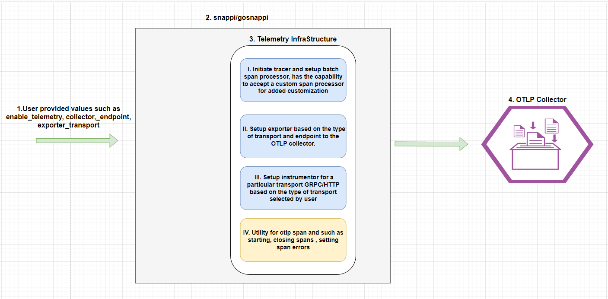

# OTLP Support in snappi





## Components

* As we can see in the diagram there are four main components.

* The first one is the user input labeled as `1` -  we need user input from the user for the following parameters. All of these parameters will be optional in nature
    * enable_telemetry - this attribute gives the user the fucntionality to use the telemetry feature or discard it if they are not interested in it. default being false
    * telemetry_exporter_transport - this attribute provides us the ability to choose the type of trasnport when we would be communicating with the collector i.e. `GRPC/HTTP`. The default of the attribute will be http
    * telemetry_collector_endpoint - User defined endpoint, basically a `URI` of the collector responsible for collecting the otlp trace log.

  <br/>
  Given below a snippet in python
  <br/>

  ```python
  # snippet with the new otlp paramters exposed in snappi
  import snappi

  snappi.api(location="https://localhost:8443", verify=False, enable_telemetry=True, telemetry_collector_endpoint="https://localhost:4318")
  ```

* The Sceond one is snappi labeled as `2` - within which the thrid component lies which is the telemetry infrastructure

* The Third one is telemetry infrastructure labeled as `3` - this is the component where the bulk of the work needs to be done for the support.
  The picture describes each of the sub components with the tasks that needs to be achieved. We would also be providing the ability for the user to fetch the OTLP tracer if they want to make some spans in their own harness or test script, snippet given below.
  
  ```python
  import snappi

  api = snappi.api(location="https://localhost:8443", verify=False, enable_telemetry=True, telemetry_collector_endpoint="https://localhost:4318")
  tracer = api.tracer()
  with tracer.start_as_current_span("custom_span_name", kind=SpanKind.CLIENT)
    # some operations or code.....
  ```

  `NOTE:` Each of the api calls in the generated SDK will have its own span using the OTLP tracer.

  As the telemetry infrastructure will be generated in `snappi/gopsnappi` it can be also used by controller to manage and implement the OTLP telemetry support.
  `Openapiart` also generates the `HTTP` server side code for `gosnappi` so we can also incorporate the interceptor part for the HTTP server implemention.

* The Fourth part is the OTLP collector labeled as `4` to which we feed the OTLP trace data, Here the collector and the visualizer can be clubed together as well.
It accepts both GRPC and HTTP transport.


## Challenges

* Its difficult from the snappi side (test client side) to stop the tracing gracefully without users intervension.
Basically the client SDK would not know when to stop the tracing untill user specifically calls the tracer to be shut down. This is more of a gosnappi issue than a snappi issue. Can We just close the tracer and its gets terminated ungracefull ? Need to explore .
For example see the below snippet in go for OTLP tracer

```go
// creating the tracer 
traceProvider := sdktrace.NewTracerProvider(
    sdktrace.WithSampler(sdktrace.AlwaysSample()),
    sdktrace.WithSpanProcessor(spanProcessor),
    sdktrace.WithResource(resources),
)

// in order to gracefully end the tracing we need to call 
traceProvider.Shutdown(context)

// the problem is client does not know when to call it and its on the user to call it ?
```

* Ideally if User provides a `collector_endpoint` both the snappi and controller should be using the same collector_endpoint so that logs can be co-related.
for this we need an `API` which communicates with the controller regarding the transport and endpoint of the collector , and It should not be part of `OTG` ?

* If some user wants to enable telemetry but does not want to delpoy colletor, we have to keep a span processor which reads the span meta-data and dump that into a file which can be treated as a log later on.
